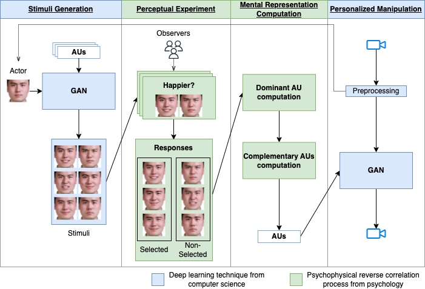

# Combining GAN with reverse correlation to construct personalized facial expressions
This is the official implementation of our journal [[paper]](https://hal.science/hal-04183020/document) "Combining GAN with reverse correlation to construct personalized facial expressions". (open-access [paper](https://journals.plos.org/plosone/article?id=10.1371/journal.pone.0290612))

For more information, please refer to our project website: [Mental-Deep-Reverse-Engineering](https://yansen0508.github.io/emotional-prototype/).

<p style="color: red;">[Update: 22/08/2023] Paper will be published on 25th Aug on PloS One.</p>

<p style="color: red;">[Update: 14/08/2023] Paper was accepted by Plos One.</p>


## Approach


## Requirements
Please install Pytorch, Torchvision, [Psychopy](https://www.psychopy.org/), and dependencies.
```shell
pip install -r requirements.txt
```

## Description
GAN is based on [GANimation](https://github.com/albertpumarola/GANimation).
The interface of the perceptual experiment is based on Psychopy.

The input image and the output images are 148 * 148. There are 16 editable Action Units, for more detail please see [Openface](https://github.com/TadasBaltrusaitis/OpenFace/wiki).

<span style="background-color: #f1f1f1; padding: 5px;"><code>datasets/results/</code></span>:
All the generated images can be found in <span style="background-color: #f1f1f1; padding: 5px;"><code>test_ganimation_30</code></span>.

<span style="background-color: #f1f1f1; padding: 5px;"><code>datasets/test/imgs/</code></span>: image folder.

<span style="background-color: #f1f1f1; padding: 5px;"><code>datasets/test/aus_openface_new560.pkl</code></span>: dictionary containing the action units of each image.

<span style="background-color: #f1f1f1; padding: 5px;"><code>datasets/test/train_ids.csv</code></span>: the file containing the names of the images to be used to train.

<span style="background-color: #f1f1f1; padding: 5px;"><code>datasets/test/test_ids.csv</code></span>: the file containing the names of the images to be used to test.

<span style="background-color: #f1f1f1; padding: 5px;"><code>csv/</code></span>: containing all the trial information.

<span style="background-color: #f1f1f1; padding: 5px;"><code>subject/</code></span>: 560 different faces are generated by activating 3 out of 16 action units. 
Example subject comes from [MMI datasets](https://mmifacedb.eu/).

<span style="background-color: #f1f1f1; padding: 5px;"><code>*.txt</code></span>: texts displayed during the perceptual experiments.

Please download the pretrained model from [here](https://drive.google.com/file/d/1f9moiWKiyPMJ9wtrihJY6yeAKVed9SXg/view?usp=sharing) and [here](https://drive.google.com/file/d/1geTeVf0v8was3GdBjLbeTnv_uLpbLPl6/view?usp=sharing).  Then put them at <span style="background-color: #f1f1f1; padding: 5px;"><code>ckpts/190327_160828/</code></span>

### Generating 560 different facial expressions by a specific actor.
According to [Openface](https://github.com/TadasBaltrusaitis/OpenFace/wiki), a list of editable action units is provided: AU1, AU2, AU4, AU5, AU6, AU7, AU9, AU10, AU12, AU14, AU15, AU17, AU20, AU23, AU25, AU26, AU43.

According to [GANimation](https://github.com/albertpumarola/GANimation), you need to prepare the photo of a specific actor (e.g., your photograph), <span style="background-color: #f1f1f1; padding: 5px;"><code>train_ids.csv</code></span>, <span style="background-color: #f1f1f1; padding: 5px;"><code>test_ids.csv</code></span>, and <span style="background-color: #f1f1f1; padding: 5px;"><code>aus_openface.pkl</code></span>.

As mentioned in our paper, the objective is to generate the facial expression based on the actor's face and a list of AUs.

#### The actor's face
You need Openface to preprocess the actor's photo.
Please use Openface to extract the intensities of Action Units.

#### aus_openface.pkl
You can create a dictionary named <span style="background-color: #f1f1f1; padding: 5px;"><code>data</code></span> to record which Action Units are activated in each facial expression.
For example, <span style="background-color: #f1f1f1; padding: 5px;"><code>data['10']=[0,0,0,0,0,0,0,0,0,0,0,0,0,0,0,0,0,0,0,0,0]</code></span> means that all action units in the image "10.bmp" will not be activated, i.e. a neutral face.
<span style="background-color: #f1f1f1; padding: 5px;"><code>data['1']=[0,0,0,0,0,0,0,0,2,0,0,0,0,0,0,0,0,0,0,0,0]</code></span> means that Action Unit 12 in the image "1.bmp" will be activated.
By assigning values (between 0 and 5), you can activate the corresponding AU.

And save them into <span style="background-color: #f1f1f1; padding: 5px;"><code>aus_openface.pkl</code></span>:
<pre>
<code class="python">
import pickle
output = open("datasets/test/aus_openface.pkl", 'wb')
pickle.dump(data, output)
output.close()
</code>
</pre>
Note that "0.bmp" should be the actor's face. That is to say, the intensity of each AU of the actor's photo (preprocessed by Openface) should be saved at <span style="background-color: #f1f1f1; padding: 5px;"><code>data['0']</code></span>. Thus GAN will generate facial expressions based on the sample (i.e., <span style="background-color: #f1f1f1; padding: 5px;"><code>data['0']</code></span>).

#### train_ids.csv,  test_ids.csv
Make sure you already have the csv file in <span style="background-color: #f1f1f1; padding: 5px;"><code>datasets/results/test</code></span>. And each image is included in the csv file.
Next run the following code and the GAN will generate facial expressions with the corresponding AUs activated (you can find them in the path of <span style="background-color: #f1f1f1; padding: 5px;"><code>output_folder</code></span>).

<pre>
<code class="python">
from options import Options
from solvers import create_solver
output_folder = "datasets/results/test_ganimation_30"
opt = Options().parse()
solver = create_solver(opt)
solver.run_solver()
</code>
</pre>

In this work, we activated 3 out of the first 16 AUs, thus resulting in 560 different facial expressions.

### To perform the perceptual experiment: 
MDR.py

## Citation
If you use this code or ideas from the paper for your research, please cite our paper:
```BibTeX
@article{yan2023combining,
  title={Combining GAN with reverse correlation to construct personalized facial expressions},
  author={Yan, Sen and Soladie, Catherine and Aucouturier, Jean-Julien and Seguier, Renaud},
  journal={PloS one},
  volume={},
  number={},
  pages={},
  year={2023},
  publisher={Public Library of Science San Francisco, CA USA}
}
```

## Acknowledgement
This repository is built based on [GANimation](https://github.com/albertpumarola/GANimation), and [Openface](https://github.com/TadasBaltrusaitis/OpenFace). Sincere thanks to their wonderful works.

This project is supported by Randstad and ANR REFLETS.


